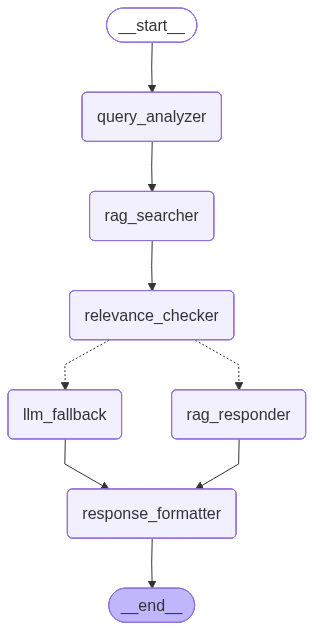

# Knowledge Base AI Chatbot

Jira/Confluence 문서 기반 RAG(Retrieval-Augmented Generation) AI 챗봇 시스템

## 프로젝트 개요

회사 내부 Jira/Confluence에 작성된 문서를 RAG 시스템에 동기화하여, 사용자 문의에 대해 회사 문서 기반 답변을 우선 제공하고, 관련 답변이 없을 경우 범용 LLM으로 fallback하는 AI 챗봇 시스템입니다.

## 주요 기능

- **Jira/Confluence 데이터 수집**: 이슈 및 페이지 자동 수집
- **증분 동기화**: 변경된 문서만 업데이트
- **삭제 감지**: 원본에서 삭제된 문서 soft-delete 처리
- **PAT 인증 지원**: Personal Access Token (Bearer 토큰) 인증
- **Cloud/Server 지원**: Atlassian Cloud 및 로컬 서버 모두 지원

## 기술 스택

### Backend
- **Framework**: FastAPI
- **Database**: PostgreSQL
- **ORM**: SQLAlchemy 2.0
- **Settings**: pydantic-settings

### AI/ML
- **LLM**: OpenAI GPT-4o-mini / Azure OpenAI GPT-4o
- **Embeddings**: text-embedding-3-large (3072 dimensions)
- **Vector DB**: FAISS IndexFlatL2
- **Framework**: LangChain, LangGraph

### External APIs
- **Atlassian**: atlassian-python-api (Jira, Confluence)

## LangGraph Workflow

사용자 질문에 대해 RAG 기반 답변을 생성하는 LangGraph 워크플로우입니다.



### 워크플로우 단계

| 단계 | Agent | 설명 |
|------|-------|------|
| 1 | **Query Analyzer** | 사용자 쿼리 분석 (intent, keywords, filters 추출) |
| 2 | **RAG Searcher** | FAISS 벡터 DB에서 유사 문서 검색 (Top-5) |
| 3 | **Relevance Checker** | 검색 결과 관련성 평가 (threshold + LLM 검증) |
| 4a | **RAG Responder** | 관련 문서 기반 응답 생성 (출처 포함) |
| 4b | **LLM Fallback** | 관련 문서 없을 시 일반 지식 기반 응답 |
| 5 | **Response Formatter** | 최종 응답 마크다운 포맷팅 |

### 응답 유형

- **RAG 응답**: 회사 문서(Jira/Confluence) 기반 답변 + 출처 링크
- **Fallback 응답**: 일반 LLM 지식 기반 답변 + 면책 문구

### 실행 예시

```python
from app.core.workflow import run_workflow

result = run_workflow("Confluence API 사용법을 알려주세요")
print(result["response"])
print(f"응답 유형: {result['response_type']}")  # rag 또는 llm_fallback
print(f"출처: {len(result['sources'])}개 문서")
```

## 프로젝트 구조

```
knowledge-base-ai-chatbot/
├── backend/
│   ├── app/
│   │   ├── config.py                    # 환경 설정
│   │   ├── database.py                  # DB 연결
│   │   ├── models/                      # SQLAlchemy 모델
│   │   │   ├── document.py              # 문서, 청크
│   │   │   ├── chat.py                  # 채팅 이력
│   │   │   ├── feedback.py              # 피드백
│   │   │   └── sync.py                  # 동기화 이력
│   │   ├── utils/                       # 유틸리티
│   │   │   ├── text_splitter.py         # 텍스트 청킹
│   │   │   └── storage.py               # Cloud Storage
│   │   └── core/
│   │       ├── services/                # 비즈니스 로직
│   │       │   ├── jira_client.py       # Jira API
│   │       │   ├── confluence_client.py # Confluence API
│   │       │   ├── data_collector.py    # 데이터 수집
│   │       │   ├── embedding_service.py # OpenAI 임베딩
│   │       │   ├── vector_db_service.py # FAISS 벡터 DB
│   │       │   ├── rag_service.py       # RAG 검색
│   │       │   └── llm_service.py       # LLM 서비스
│   │       ├── agents/                  # LangGraph 에이전트
│   │       │   ├── query_analyzer.py    # 쿼리 분석
│   │       │   ├── rag_searcher.py      # RAG 검색
│   │       │   ├── relevance_checker.py # 관련성 평가
│   │       │   ├── rag_responder.py     # RAG 응답
│   │       │   ├── llm_fallback.py      # LLM 폴백
│   │       │   └── response_formatter.py # 응답 포맷팅
│   │       └── workflow/                # LangGraph 워크플로우
│   │           ├── state.py             # ChatState 정의
│   │           └── graph.py             # 워크플로우 그래프
│   ├── scripts/
│   │   ├── init_db.py                   # DB 초기화
│   │   ├── collect_data.py              # 데이터 수집 CLI
│   │   ├── build_vector_db.py           # 벡터 DB 빌드
│   │   ├── test_search.py               # 검색 테스트
│   │   └── test_workflow.py             # 워크플로우 테스트
│   ├── data/
│   │   └── vector_db/                   # FAISS 인덱스
│   ├── requirements.txt
│   └── .env                             # (gitignore)
└── docs/
    ├── workflow_diagram.png             # 워크플로우 다이어그램
    ├── knowledge-base-ai-chatbot-plan.md
    └── knowledge-base-ai-chatbot-todo.md
```

## 설치 및 실행

### 1. 환경 설정

```bash
cd backend

# 가상환경 생성 및 활성화
python -m venv venv
source venv/bin/activate  # Windows: venv\Scripts\activate

# 의존성 설치
pip install -r requirements.txt

# 환경 변수 설정
cp .env.example .env
# .env 파일 편집하여 API 키 설정
```

### 2. PostgreSQL 데이터베이스 설정

```bash
# 데이터베이스 생성
createdb knowledge_base

# 테이블 생성
python scripts/init_db.py
```

### 3. Jira/Confluence 설정

`.env` 파일에 Atlassian 인증 정보 설정:

```env
# Jira 설정
JIRA_URL=http://localhost:8080
JIRA_USERNAME=admin
JIRA_API_TOKEN=your_personal_access_token
JIRA_PROJECT_KEY=TEST

# Confluence 설정
CONFLUENCE_URL=http://localhost:8090
CONFLUENCE_USERNAME=admin
CONFLUENCE_API_TOKEN=your_personal_access_token
CONFLUENCE_SPACE_KEY=TES
```

### 4. 데이터 수집

```bash
# 전체 수집
python scripts/collect_data.py --source all

# Jira만 수집
python scripts/collect_data.py --source jira

# Confluence만 수집
python scripts/collect_data.py --source confluence

# 삭제된 문서 감지
python scripts/collect_data.py --source all --detect-deleted

# 전체 재동기화
python scripts/collect_data.py --source all --full-sync
```

### 5. 벡터 DB 빌드

```bash
# 벡터 DB 빌드 (청킹 + 임베딩 + FAISS 인덱스)
python scripts/build_vector_db.py

# 검색 테스트
python scripts/test_search.py

# 워크플로우 테스트
python scripts/test_workflow.py --query "API 사용법을 알려주세요"
```

### 6. 연결 테스트

```bash
# Jira 연결 테스트
python scripts/test_jira.py

# Confluence 연결 테스트
python scripts/test_confluence.py
```

## 인증 방식

### Personal Access Token (PAT) - 권장

로컬 서버에서 Basic Auth가 비활성화된 경우 PAT 사용:

1. Jira/Confluence 프로필 설정으로 이동
2. Personal Access Tokens 메뉴에서 토큰 생성
3. `.env` 파일의 `*_API_TOKEN`에 설정

### Basic Auth

Cloud 환경 또는 Basic Auth가 활성화된 경우:

```env
JIRA_USERNAME=your_email
JIRA_PASSWORD=your_api_token  # Cloud의 경우 API 토큰
```

## 데이터베이스 스키마

### documents
| 컬럼 | 타입 | 설명 |
|------|------|------|
| id | Integer | PK |
| doc_id | String | 고유 문서 ID (jira-XXX, confluence-XXX) |
| doc_type | String | jira / confluence |
| title | String | 제목 |
| content | Text | 본문 |
| url | String | 원본 URL |
| is_deleted | Boolean | 삭제 여부 (soft delete) |

### sync_history
| 컬럼 | 타입 | 설명 |
|------|------|------|
| id | Integer | PK |
| source_type | String | jira / confluence / all |
| status | String | started / completed / failed |
| documents_added | Integer | 추가된 문서 수 |
| documents_updated | Integer | 업데이트된 문서 수 |
| documents_deleted | Integer | 삭제된 문서 수 |

## 개발 로드맵

- [x] Week 1: 프로젝트 초기 설정 및 데이터 수집
- [x] Week 2: 임베딩 및 벡터 DB 구축 (FAISS, text-embedding-3-large)
- [x] Week 3: LangGraph 워크플로우 및 RAG 파이프라인
- [ ] Week 4: FastAPI 엔드포인트 구현
- [ ] Week 5: 배치 프로세스 (증분 동기화)
- [ ] Week 6-7: React 프론트엔드 (Chat, Dashboard, Settings)
- [ ] Week 8: GCP 배포 (Cloud Run, Cloud SQL)
- [ ] Week 9-10: 테스트, 최적화, 문서화

## 라이선스

Private - 내부 사용 전용
