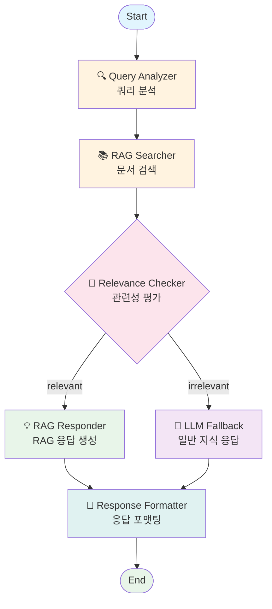

# Knowledge Base AI Chatbot - LangGraph Workflow

## Workflow Diagram



## Workflow Description

### 1. Query Analyzer (쿼리 분석)
- 사용자 입력 쿼리 분석
- Intent, Keywords, Filters 추출
- JSON 형식으로 구조화

### 2. RAG Searcher (문서 검색)
- FAISS 벡터 데이터베이스 검색
- Top-K 유사 문서 검색 (K=5)
- 메타데이터 필터링 (doc_type, date)

### 3. Relevance Checker (관련성 평가)
- 유사도 점수 임계값 체크 (threshold=0.35)
- LLM 기반 의미론적 관련성 검증
- relevant/irrelevant 결정

### 4a. RAG Responder (RAG 응답)
- 검색된 문서 컨텍스트 기반 응답 생성
- 출처 정보 포함
- response_type = "rag"

### 4b. LLM Fallback (일반 지식 응답)
- 관련 문서 없을 때 일반 지식 기반 응답
- 면책 문구 포함
- response_type = "llm_fallback"

### 5. Response Formatter (응답 포맷팅)
- Markdown 형식 포맷팅
- 참고 문서 섹션 추가
- 최종 응답 반환

## State Definition

```python
class ChatState(TypedDict):
    user_query: str                           # 사용자 입력
    analyzed_query: AnalyzedQuery | None      # 분석된 쿼리
    search_results: list[SearchResult]        # 검색 결과
    relevance_decision: Literal["relevant", "irrelevant"] | None
    response: str                             # 최종 응답
    response_type: Literal["rag", "llm_fallback"] | None
    sources: list[Source]                     # 출처 목록
    messages: Annotated[list[Any], add_messages]  # 대화 이력
    error: str | None                         # 에러 메시지
```

## Files

| File | Description |
|------|-------------|
| `app/core/workflow/state.py` | State TypedDict 정의 |
| `app/core/workflow/graph.py` | LangGraph 워크플로우 정의 |
| `app/core/agents/query_analyzer.py` | Query Analyzer 에이전트 |
| `app/core/agents/rag_searcher.py` | RAG Searcher 에이전트 |
| `app/core/agents/relevance_checker.py` | Relevance Checker 에이전트 |
| `app/core/agents/rag_responder.py` | RAG Responder 에이전트 |
| `app/core/agents/llm_fallback.py` | LLM Fallback 에이전트 |
| `app/core/agents/response_formatter.py` | Response Formatter 에이전트 |
| `app/core/services/llm_service.py` | LLM 서비스 |
